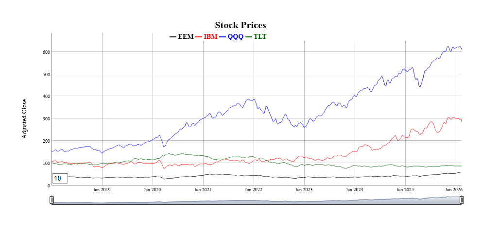
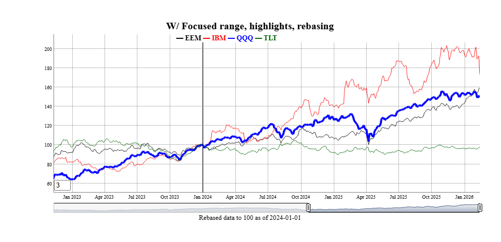
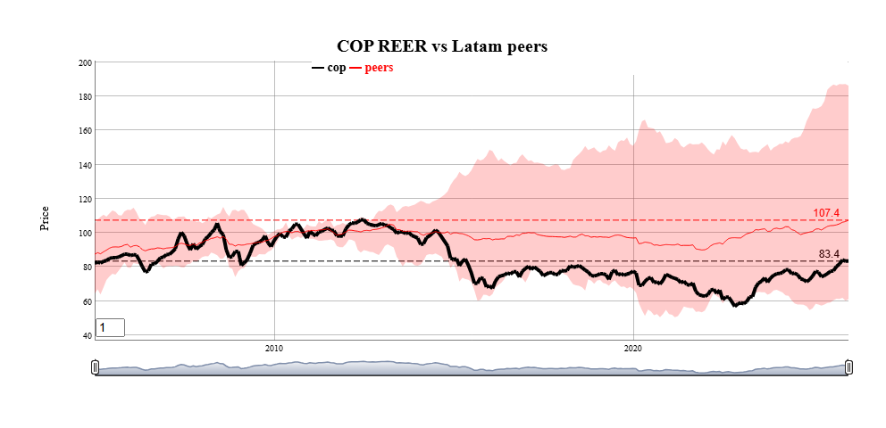
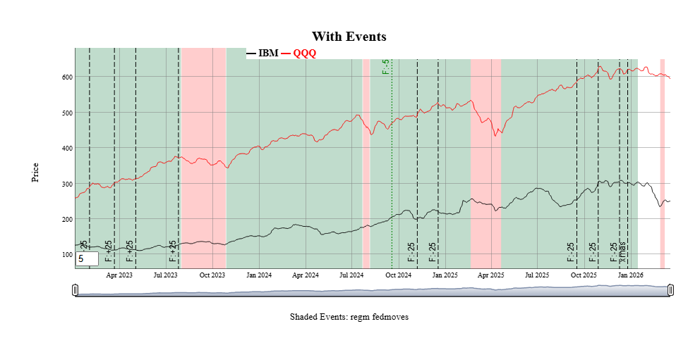
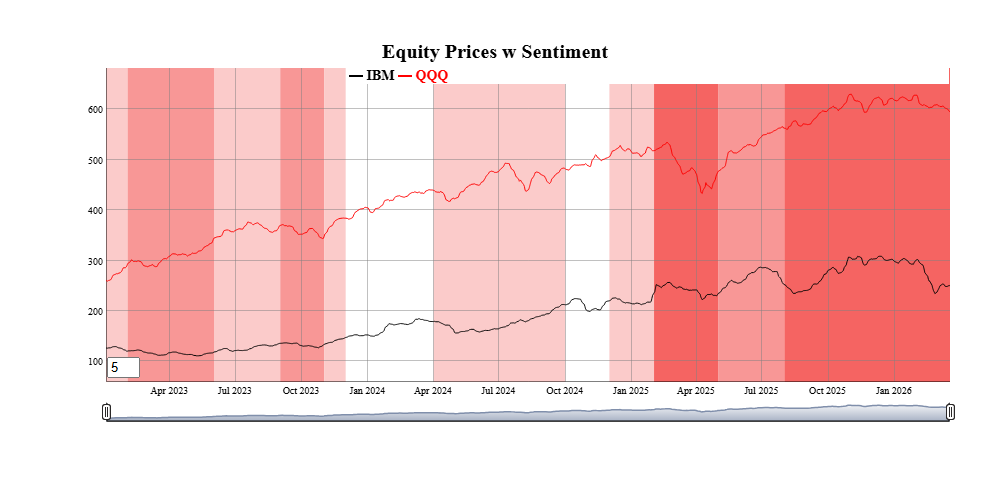
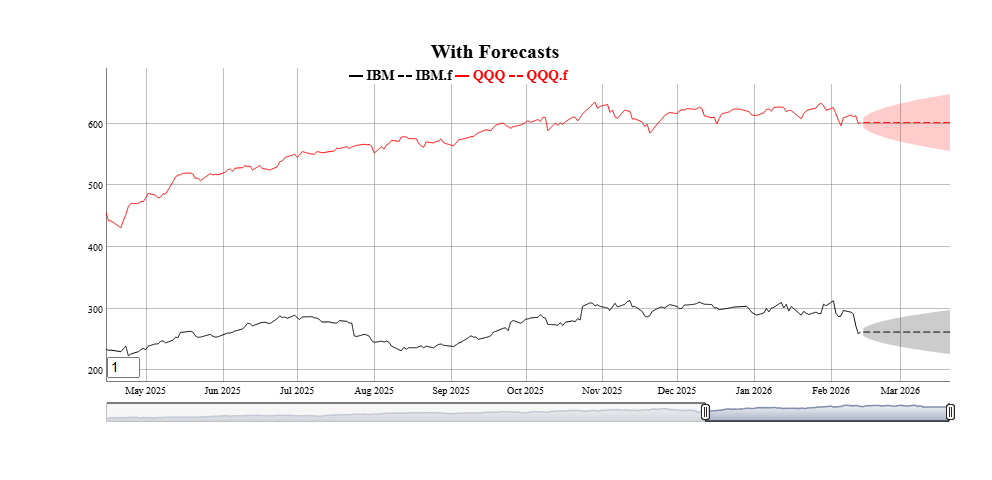

<!-- README.md is generated from README.Rmd. Please edit that file -->

# FinanceGraphs

<!-- badges: start -->

<!-- badges: end -->

A flexible wrapper around [dygraphs](https://dygraphs.com/) and
[ggplot2](https://ggplot2.tidyverse.org/) to graph and annototate
financial time series data.  
The package provides several ways to add additional information to a
simple series vs time data, including horizontal annotations (events
highligted by lines and colored bands) and vertical annotations (key
levels or regions). Colors and set of labels can be customized and
persist across invocations of the package, but sensible defaults are
used. To minimize verbiage to get what you want, the package emphasizes
options in the main function call rather than multiple functions or
pipes to build up a graph.

You can install the development version of FinanceGraphs from

``` r
pak::pak("derekholmes0/FinanceGraphs")
# install.packages("FinanceGraphs")  # If from CRAN
```

# Dygraphs for time series

## Input data and Constants

The package is designed to be flexible with input data. The data can
either be in **long** format (e.g. `date`,`series`,`value`) or **wide**
format (`date`,`col1`,`col2`,…).  
The `date` column can be called anything or be anywhere in the input
data.frame, but there must be at least one coercible column with dates
and one numeric column. Each column after the date column is treated as
a separate series to be graphed, but if the column name (series name)
ends in any of ‘`.lo`, `.hi`, `.f` (for forecast),’`.flo`, `.fhi` then
those columns are treated specially as lower/upper bands or forecast
series associated with the prefix of the name.

Consistent colors used for all series and annotations are kept in a
local (persistent) settings `data.frame`. Default color schemes can be
changed (again persisantly) using the \[fg_update_colors()\] function.

## Simple Examples

``` r
require(FinanceGraphs)
#> Loading required package: FinanceGraphs
#> Registered S3 method overwritten by 'quantmod':
#>   method            from
#>   as.zoo.data.frame zoo
fgts_dygraph(eqtypx, title="Stock Prices", ylab="Adjusted Close")
```


\* All of the data is displayed on the graph by default, but nost of the
time, we want to focus on recent periods and have the option of backing
up to all history. The `dtstartfrac` parameter shows just the last
(1-`dtstartfrac`) percent of the data. Alternatively, a *generic date
window* of the form “start::end” can be used in the `dtwindow`
parameter. Each end of the window can be a full date (e.g. “2022-01-01”)
or a relative date string (e.g. “-6m” for 6 months ago.

- One of the most appealing features of \[dygraphs\] is the ability to
  smooth series interactively. The `roller` parameter adds a rolling
  average smoother of the specified width (in data points). A default
  smoothing parameter is chosen depending on the length of the
  underlying data, but can be overridden using the `roller` parameter.

- Individual series can be altered in several ways:

  - Highlighted with different stroke patterns and width using the
    `hilightcols` argument with a string (possibly list) of series
    names, `hilightwidth` for a new width, and `hilightstyle` for a new
    stroke pattern.
  - Shown a step plot using the `stepcols` argument with a string
    (possibly list) of series names.
  - Hidden from using the `hidecols` argument with a string (possibly
    list) of series names.
  - Rebased to a given constant at a particular date.

``` r
fgts_dygraph(eqtypx, title="W/ Focused range, highlights, rebasing",
             dtstartfrac=0.6,hilightcols="QQQ",hilightwidth=4,rebase="2024-01-01,100",roller=3)
```



- Series can be grouped together into bands by adding new columns in the
  data with names ending in ‘`.lo`’ and ‘`.hi`’ for lower and upper
  bounds. Those additional series can represent many things, such as
  statistical extremes, rolling correlations to other variables (see
  vignette), or (as a special case) forecast confidence intervals.

- Horizontal annotations can also be added using the `annotations`
  parameter. The most common example is a horizontal line at the last
  observations of each series.

``` r
toplot <- reerdta[REGION=="LATAM",.(cop=sum(value*(variable=="COL")),
               peers=mean(value),peers.lo=min(value),peers.hi=max(value)),by=.(date)]
fgts_dygraph(toplot,title="COP REER vs Latam peers",ylab="Price",
             roller=1,hilightcols="cop",hilightwidth=4,annotations="last,linevalue")
```



## Events

Annotations to a particular date or date range can be added to the graph
using the `events` and `event_ds` parameters.  
The `events` parameter is a string with one or more (separated by
semicolons) event specifications. The `event_ds` parameter is an
optional data.frame with user defined events. (See Vignette for
examples) Any events specified with either parameter are additive.

### Events in the function call

Events always have a start date and a text label. THey are shown as
vertical lines on the graph unless they also have an End Date, in which
case the entire region is shaded. Event strings starting with `doi`
(date of interest) are predefined events included with the package.
Those are customizable using the \[fg_update_dates_of_interest()\] and
can be listed using \[fg_list_dates_of_interest()\]. Event strings can
be added together with semicolons, as in the following example:

``` r
smalldta <- eqtypx[date>=as.Date("2023-01-01"),.(date,TLT,EEM)]
fgts_dygraph(smalldta,title="With Events",ylab="Price",events="doi,regm;doi,fedmoves;date,xmas,2025-12-25")
```


Several types of events are predefined in \[fgts_dygraph()\] including
equity option expirations, IMM CDS roll dates, seasonal events
(e.g. “same day in quarter as last observation”) and series extremes.
See the vignette for more examples. Events can also be passed in as a
`data.frame` using the `event_ds` parameter, as shown next.

### Event helpers

Custom events can also be passed in `data.frame` format using the
`event_ds` parameter. The details are in \[fgts_dygraph()\], but the
basic columns are a start date date, a text label, and if applicable an
end date. Only events within the dates of the original input data are
shown.

The package includes a few “event helpers” to make it easy to generate
the right formats for given more complicated types of events and
exogenous data. See the vignette for examples, but here is an idea of
two that can be done.

``` r
events_consumer_sent <- fg_cut_to_events(consumer_sent,center="zscore")
head(events_consumer_sent,2)
#>    value     color END_DT_ENTRY   DT_ENTRY runlen
#>    <int>    <char>       <Date>     <Date>  <int>
#> 1:     3 #9595FFFF   2016-03-02 2016-01-01      3
#> 2:     2 #CACAFFFF   2016-04-02 2016-03-02      1
fgts_dygraph(smalldta,title="Equity Prices w Sentiment",event_ds=events_consumer_sent)
```


Current event helpers are:

| Function | Description |
|:---|:---|
| `fg_findTurningPoints()` | Statistically identify turning points in a series |
| `fg_ratingsEvents()` | Add colored ranges based on analyst credit ratings |
| `fg_cut_to_events()` | “Cut” a univariate series into colored bands, with two different colors for positive and negative values |
| `fg_signal_to_events()` | Map a long/short signal to events |
| `fg_tq_divs()` | Add dividend events from TidyQuant dividend data |
| `fg_av_earnings()` | Add earnings events from AlphaVantage earnings data |

## Forecasts

Forecasts beyond the last day of the dataset can also be added in a
consistent way. For example, forecasts (and confidence intervals) for
the IBM stock price in new `data.frame` can be added as follows. Each
forecast is shown as the same color as the original series, but dashed
to show the transition.

``` r
smalldta <- eqtypx[date>=as.Date("2023-01-01"),.(date,IBM,QQQ)]
head(example_fcst_set,2)
#> Key: <date>
#>          date    QQQ.f  QQQ.flo  QQQ.fhi    IBM.f  IBM.flo  IBM.fhi
#>        <Date>     <ts>    <num>    <num>     <ts>    <num>    <num>
#> 1: 2026-01-31 622.6611 615.9843 629.3379 306.9482 301.3265 312.5699
#> 2: 2026-02-01 622.9118 613.7795 632.0441 307.1080 299.3237 314.8924
fgts_dygraph(smalldta,title="With Forecasts", dtstartfrac=0.7,forecast_ds=example_fcst_set)
```



Like events, forecasts can be generated from many packages with
different output formats. There are also “forecast helpers” to get their
outputs into the appropriate `foreast_ds` forms

| Function | Description |
|:---|:---|
| `fg_sweep()` | Converts [tidy forecast objects](https://business-science.github.io/sweep/) to `forecast_ds` form. |
| `fg_forecast()` | Converts [forecasts](https://pkg.robjhyndman.com/forecast/) to `forecast_ds` form. |

## Changing colors and adding dates of interest

Default colors for series and annotations can be changed using
\[fg_update_colors()\] or \[fg_update_line_colors()\].  
Any changes made to colors will persist across loads of the package
(unless `persist=FALSE` is specified). As an example, to make a
graduated set of colors for the first 3 series.

``` r
fg_get_colors("lines",n_max=4)
#>    category variable     color  const
#>      <char>   <char>    <char> <lgcl>
#> 1:    lines      D01     black     NA
#> 2:    lines      D02       red     NA
#> 3:    lines      D03 darkgreen     NA
#> 4:    lines      D04      blue     NA
fg_update_line_colors( rev(RColorBrewer::brewer.pal(8,"GnBu"))[1:3] )
#> Saved Colors of interest file to C:\Users\DFH\AppData\Local/R/cache/R/FinanceGraphs/fg_colors.RD
fg_get_colors("lines",n_max=4)
#> Key: <category, variable>
#>    category variable   color  const
#>      <char>   <char>  <char> <lgcl>
#> 1:    lines      D01 #08589E     NA
#> 2:    lines      D02 #2B8CBE     NA
#> 3:    lines      D03 #4EB3D3     NA
#> 4:    lines      D04    blue     NA
```

New dates of interest used for the `events` parameter can also be added.
To add (for example) a new FOMC cut of 50bps on 6/16/2026 (after the
development of this package), use \[fg_update_dates_of_interest()\].
Resetting the lists (and colors) can also be done.

``` r
newdoi <-data.frame(category="fedmoves",eventid="F:-50",DT_ENTRY=as.Date("6/16/2026",format="%m/%d/%Y"))
fg_update_dates_of_interest(newdoi)
#> Saved dates of interest file to C:\Users\DFH\AppData\Local/R/cache/R/FinanceGraphs/fg_doi.RD
tail(fg_get_dates_of_interest("fedmoves"),2)  |> data.frame()
#>   category eventid eventid2   DT_ENTRY END_DT_ENTRY color strokePattern  loc
#> 1 fedmoves   F:-25  rt:3.75 2025-12-10   2025-12-10  <NA>          <NA> <NA>
#> 2 fedmoves   F:-50     <NA> 2026-06-16   2026-06-16  <NA>          <NA> <NA>
fg_reset_to_default_state()
```
