<!-- README.md is generated from README.Rmd. Please edit that file -->

# FinanceGraphs

<!-- badges: start -->

<!-- badges: end -->

A flexible wrapper around [dygraphs](https://dygraphs.com/) and
[ggplot2](https://ggplot2.tidyverse.org/) to graph and annototate
financial time series data.  
The package provides several ways to add additional information to a
simple series vs time data, including horizontal annotations (events
highligted by lines and colored bands) and vertical annotations (key
levels or regions). Colors and set of labels can be customized and
persist across invocations of the package, but sensible defaults are
used. To minimize verbiage to get what you want, the package emphasizes
options in the main function call rather than multiple functions or
pipes to build up a graph.

You can install the development version of FinanceGraphs from

``` r
pak::pak("derekholmes0/FinanceGraphs")
# install.packages("FinanceGraphs")  # If from CRAN
```

# Dygraphs for time series

## Input data and Constants

The package is designed to be flexible with input data. The data can
either be in **long** format (e.g. `date`,`series`,`value`) or **wide**
format (`date`,`col1`,`col2`,…).  
The `date` column can be called anything or be anywhere in the input
data.frame, but there must be at least one coercible column with dates
and one numeric column. Each column after the date column is treated as
a separate series to be graphed, but if the column name (series name)
ends in any of ‘`.lo`, `.hi`, `.f` (for forecast),’`.flo`, `.fhi` then
those columns are treated specially as lower/upper bands or forecast
series associated with the prefix of the name.

Consistent colors used for all series and annotations are kept in a
local (persistent) settings `data.frame`. Default color schemes can be
changed (again persistently) using the `fg_update_aes()` function.

## Simple Examples

``` r
fgts_dygraph(eqtypx, title="Stock Prices", ylab="Adjusted Close")
```

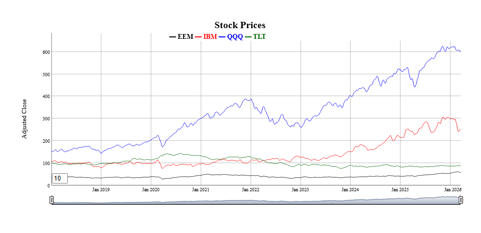
\* All of the data is displayed on the graph by default, but nost of the
time, we want to focus on recent periods and have the option of backing
up to all history. The `dtstartfrac` parameter shows just the last
(1-`dtstartfrac`) percent of the data. Alternatively, a *generic date
window* of the form “start::end” can be used in the `dtwindow`
parameter. Each end of the window can be a full date (e.g. “2022-01-01”)
or a relative date string (e.g. “-6m” for 6 months ago.

- One of the most appealing features of
  [dygraphs](https://dygraphs.com/) is the ability to smooth series
  interactively. The `roller` parameter adds a rolling average
  smootherof the specified width (in data points). A default smoothing
  parameter is chosen depending on the length of the underlying data,
  but can be overridden using the `roller` parameter.

- Individual series can be altered in several ways:

  - Highlighted with different stroke patterns and width using the
    `hilightcols` argument with a string (possibly list) of series
    names, `hilightwidth` for a new width, and `hilightstyle` for a new
    stroke pattern.
  - Shown a step plot using the `stepcols` argument with a string
    (possibly list) of series names.
  - Hidden from using the `hidecols` argument with a string (possibly
    list) of series names.
  - Rebased to a given constant at a particular date.

``` r
fgts_dygraph(eqtypx, title="W/ Focused range, highlights, rebasing",
             dtstartfrac=0.6,hilightcols="QQQ",hilightwidth=4,rebase="2024-01-01,100",roller=3)
```

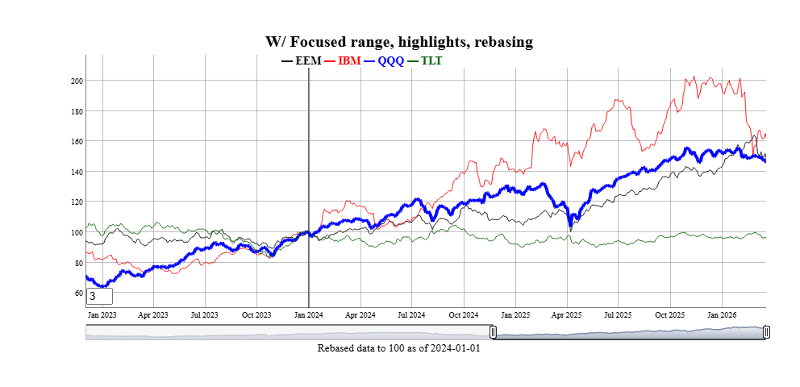

- Series can be grouped together into bands by adding new columns in the
  data with names ending in ‘`.lo`’ and ‘`.hi`’ for lower and upper
  bounds. Those additional series can represent many things, such as
  statistical extremes, rolling correlations to other variables (see
  vignette), or (as a special case) forecast confidence intervals.

- Horizontal annotations can also be added using the `annotations`
  parameter. The most common example is a horizontal line at the last
  observations of each series.

``` r
toplot <- reerdta[REGION=="LATAM",.(cop=sum(value*(variable=="COL")),
               peers=mean(value),peers.lo=min(value),peers.hi=max(value)),by=.(date)]
fgts_dygraph(toplot,title="COP REER vs Latam peers",ylab="Price",
             roller=1,hilightcols="cop",hilightwidth=4,annotations="last,linevalue")
```

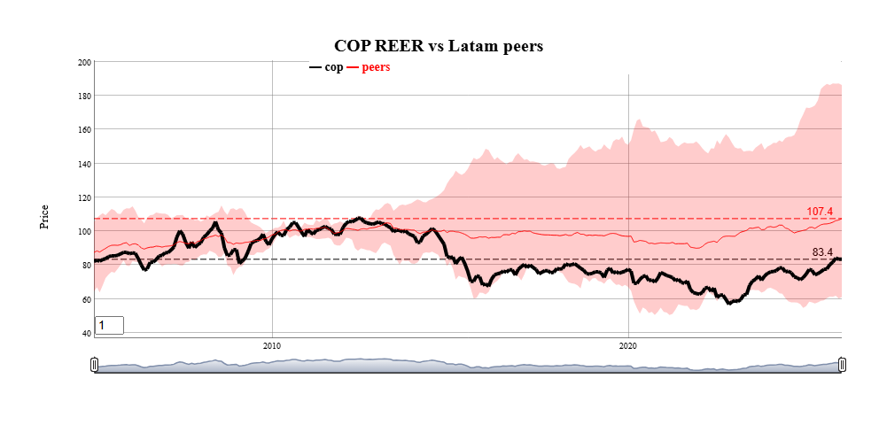

## Events

Annotations to a particular date or date range can be added to the graph
using the `events` and `event_ds` parameters.  
The `events` parameter is a string with one or more (separated by
semicolons) event specifications. The `event_ds` parameter is an
optional data.frame with user defined events. (See Vignette for
examples) Any events specified with either parameter are additive.

### Events in the function call

Events always have a start date and a text label. THey are shown as
vertical lines on the graph unless they also have an End Date, in which
case the entire region is shaded. Event strings starting with `doi`
(date of interest) are predefined events included with the package.
Those are customizable using the `fg_update_dates_of_interest()` and can
be listed using `fg_list_dates_of_interest()`. Event strings can be
added together with semicolons, as in the following example:

``` r
smalldta <- eqtypx[date>=as.Date("2023-01-01"),.(date,IBM,QQQ)]
fgts_dygraph(smalldta,title="With Events",ylab="Price",events="doi,regm;doi,fedmoves;date,xmas,2025-12-25")
```

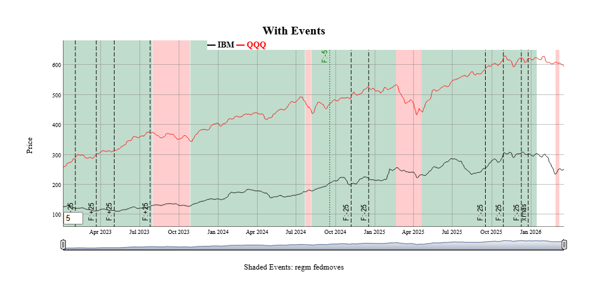
Several types of events are predefined in `fgts_dygraph()` including
equity option expirations, IMM CDS roll dates, seasonal events
(e.g. “same day in quarter as last observation”) and series extremes.
See the vignette for more examples. Events can also be passed in as a
`data.frame` using the `event_ds` parameter, as shown next.

### Event helpers

Custom events can also be passed in `data.frame` format using the
`event_ds` parameter. The details are in `fgts_dygraph()`, but the basic
columns are a start date date, a text label, and if applicable an end
date. Only events within the dates of the original input data are shown.

The package includes a few “event helpers” to make it easy to generate
the right formats for given more complicated types of events and
exogenous data. See the vignette for examples, but here is an idea of
two that can be done.

``` r
events_consumer_sent <- fg_cut_to_events(consumer_sent,center="zscore")
head(events_consumer_sent,2)
#>    value     color END_DT_ENTRY   DT_ENTRY runlen
#> 1:     3 #9595FFFF   2016-03-02 2016-01-01      3
#> 2:     2 #CACAFFFF   2016-04-02 2016-03-02      1
fgts_dygraph(smalldta,title="Equity Prices w Sentiment",event_ds=events_consumer_sent)
```

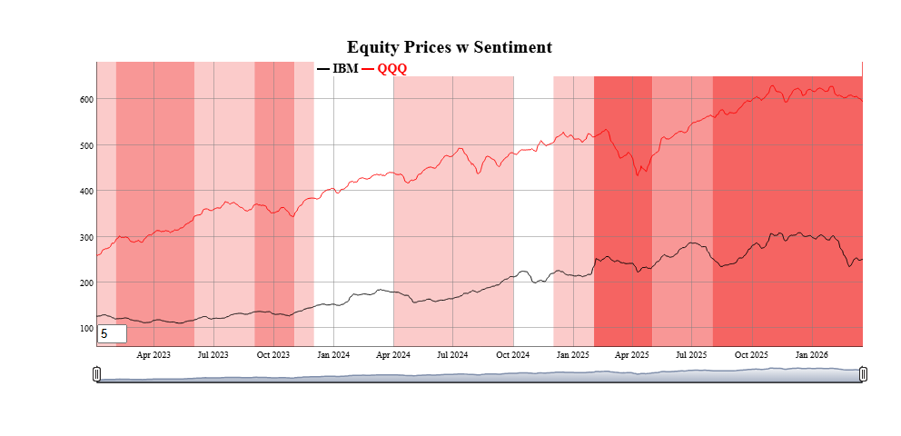
Current event helpers are:

| Function | Description |
|:---|:---|
| `fg_findTurningPoints()` | Statistically identify turning points in a series |
| `fg_ratingsEvents()` | Add colored ranges based on analyst credit ratings |
| `fg_cut_to_events()` | “Cut” a univariate series into colored bands, with two different colors for positive and negative values |
| `fg_signal_to_events()` | Map a long/short signal to events |
| `fg_tq_divs()` | Add dividend events from TidyQuant dividend data |
| `fg_av_earnings()` | Add earnings events from AlphaVantage earnings data |

## Forecasts

Forecasts beyond the last day of the dataset can also be added in a
consistent way. For example, forecasts (and confidence intervals) for
the IBM stock price in new `data.frame` can be added as follows. Each
forecast is shown as the same color as the original series, but dashed
to show the transition.

``` r
head(example_fcst_set,2)
#>          date    QQQ.f  QQQ.flo  QQQ.fhi    IBM.f  IBM.flo  IBM.fhi
#> 1: 2026-02-14 601.8882 593.7090 610.0673 262.3268 256.2824 268.3712
#> 2: 2026-02-15 601.8882 590.6732 613.1032 262.3268 253.8659 270.7877
fgts_dygraph(smalldta,title="With Forecasts", dtstartfrac=0.7,forecast_ds=example_fcst_set)
```

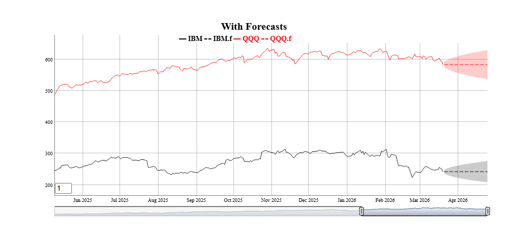

Like events, forecasts can be generated from many packages with
different output formats. There is also a “forecast helper” to get their
outputs into the appropriate `foreast_ds` forms

| Function | Description |
|:---|:---|
| `fg_sweep()` | Converts [tidy forecast objects](https://business-science.github.io/sweep/) to `forecast_ds` form. |
| `fg_prophet()` | Converts [Prophet](https://business-science.github.io/sweep/) to `forecast_ds` form. |

## Changing aesthetics and adding “dates of interest”

Default colors for series and annotations can be changed using
`fg_update_aes()` or `fg_update_line_colors()`. Any changes made to
aesthetics colors will persist across loads of the package (unless
`persist=FALSE` is specified). To see what aesthetics are used for any
particular function, use `fg_print_aes_list()` As an example, to make a
graduated set of colors for the first 2 series.

``` r
fg_get_aes("lines",n_max=2)
#>    category variable  type value const used                     helpstr
#> 1:    lines      D01 color black        all Low cardinality line colors
#> 2:    lines      D02 color   red        all Low cardinality line colors
fg_update_line_colors( rev(RColorBrewer::brewer.pal(8,"GnBu"))[1:2] )
#> Saved updates to C:\Users\DFH\AppData\Local/R/cache/R/FinanceGraphs/fg_aes.RD
fg_get_aes("lines",n_max=3)
#>    category variable  type   value const used                     helpstr
#> 1:    lines      D01 color #08589E        all Low cardinality line colors
#> 2:    lines      D02 color #2B8CBE        all Low cardinality line colors
#> 3:    lines      D03 color    blue        all Low cardinality line colors
```

New dates of interest used for the `events` parameter can also be added.
To add (for example) a new FOMC cut of 50bps on 6/16/2026 (after the
development of this package), use `fg_update_dates_of_interest()`.
Resetting the lists (and colors) can also be done.

``` r
newdoi <-data.frame(category="fedmoves",eventid="F:-50",DT_ENTRY=as.Date("6/16/2026",format="%m/%d/%Y"))
fg_update_dates_of_interest(newdoi)
#> Saved dates of interest file to C:\Users\DFH\AppData\Local/R/cache/R/FinanceGraphs/fg_doi.RD
tail(fg_get_dates_of_interest("fedmoves"),2)  |> data.frame()
#>   category eventid eventid2   DT_ENTRY END_DT_ENTRY color strokePattern  loc
#> 1 fedmoves   F:-25     rt:4 2025-10-29   2025-10-29  <NA>          <NA> <NA>
#> 2 fedmoves   F:-25  rt:3.75 2025-12-10   2025-12-10  <NA>          <NA> <NA>
fg_reset_to_default_state()
#> Removing dates file and reverting to defaults of package
#> Removing Aesthetics file and reverting to defaults of package
#> Removing User-made Themes and reverting to defaults of package
#> fg_reset_to_default_state(all) completed
```

## Integration into Markdown and Shiny

Dygraphs have the very nice feature of allowing synchronized zoom in
Markdown or Shiny applications. Each graph with a common `group`
identifier is synchronized. There are times, however, when you want to
turn these on or off. The function `fg_sync_group()` either returns the
current group name if called with no parameters, sets the group name
with a string, or turns off synchronization with a call
`fg_sync_group(NULL)`.

# Static Plots for Time Series

## Scatter Plots with time dimension enhancements

Key to understanding how time series co-move is a simple scatter plot.
The function `fg_scatplot()` tries to be a concise wrapper around the
very comprehensive [ggplot2](https://ggplot2.tidyverse.org/) graphics
framework. `ggplot2()` is a great ecosystem, but requires quite a bit of
verbiage to get from idea to presentable graph quickly. The approach
used here is to specify broad categories of aesthetics with a formula,
while the details are kept behind the hood using the aesthetic sets
managed by `fg_get_aes()` as above. Fuller explanations and more
examples are in the accompanying vignette.

This “one-line” approach can be used with both date-based and non-date
based datasets. For example, suppose we wanted to plot two asset prices
against each other so that we can easily understand both how they
co-move, where they have been recently, and where they are now. We will
start by making a fake dataset of two sets of two assets each.

``` r
set.seed(1)
ndates <- 400;
samp_rw <- function() { 100*(1+cumsum(rnorm(ndates,sd=0.2/sqrt(260)))) }
dts <- seq(as.Date("2021-01-01"),as.Date("2021-01-01")+ndates-1)
dttest <- rbind( data.table(date=dts,ccat="A",px_x=samp_rw(),px_y=samp_rw()),
                 data.table(date=dts,ccat="B",px_x=samp_rw(),px_y=samp_rw()))
```

A scatter plot of where those two assets are and where they have been is
as easy as specifying (in one string!) columns to plot, a column for
color, and a term to split the dates into 2 month and 6 month intervals,
and finally a term to show where the latest observations are. As with
`fgts_dygraph()`, date partitions can be custom regimes managed by
`fg_update_dates_of_interest()`.

``` r
fg_scatplot(dttest,"px_y ~ px_x + color:ccat + doi:recent + point:label","lmone",datecuts=c(60,182),title="Splitting dates")
```

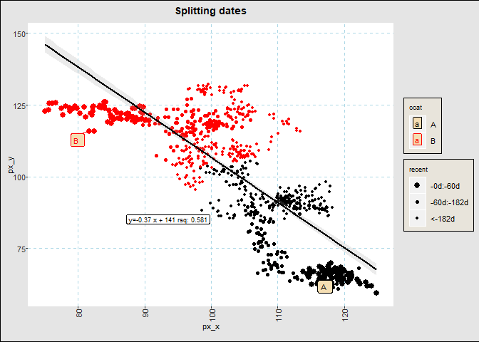
One important feature of the static plots in this package to note is
that they include options for switching the colors of large numbers of
groups or points from discrete values to continuous values from the
[RColorBrewer](https://colorbrewer2.org) package.

`fg_scatplot()` does not require dates in the input data, and can be
useful for communicating comparative analyses as well. The `mtcars`
dataset shows how we can add a lot of information to a basic text
scatterplot.

``` r
dt_mtcars=data.table(datasets::mtcars)[,let(id=lapply(rownames(datasets::mtcars),\(x) last(strsplit(x," ")[[1]])))]
fg_scatplot(dt_mtcars,"disp ~ hp + color:carb + label:id","lmonenoeqn",n_color_switch=0,title="Text with color switch")
```

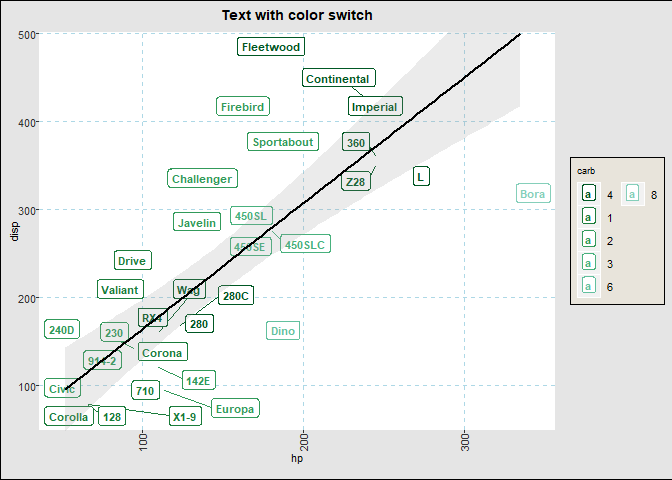

Many more examples that encapsulate a large part of the
[ggplot2](https://ggplot2.tidyverse.org/) corpus are in the accompanying
vignette.

## Time-categorized box plots

One way to visualize multiple time series comparatively with a boxplot
or a violin plot. The function `fg_tsboxplot()` provides a flexible way
to split several time series into time categories. Usually, those
categories are time periods with increasing horizons, but this function
allows for arbitrary periods managed by `fg_update_dates_of_interest()`.
Data can be normalized across historical categories and time series
categories. As an example, suppose we would like to see normalized
equity prices over the past two years, split into categories of the last
week, month (less the last week) and the last quarter.

``` r
fg_tsboxplot(narrowbydtstr(eqtypx,"-2y::"),breaks=c(7,90),normalize="byvar",title="Normalized Equity prices by Date category")
```

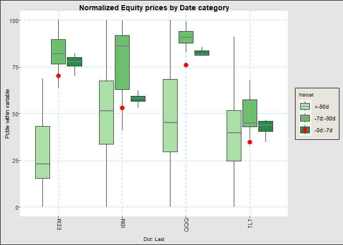

Like `fgts_dygraph()`, the function can take data in both wide and long
formats. Longer formats have the advantage of adding more categorical
levels to our graphs. For example, we can plotting recent ranges of the
monthly FX Real Exchange Rate dataset in the following way. Here, we
split the data into buckets of last 20pct of the months, the first half
the months and the last. We will also show the last observation, hide
the boxplot whiskers, and reorder the currencies by their relative
weakness.

``` r
fg_tsboxplot(reerdta,breaks=c(0,0.2,0.5,1),doi="last",orderby="value",boxtype="nowhisker",facetform=". ~ REGION",title="Real Eff. Exch Rates")
```

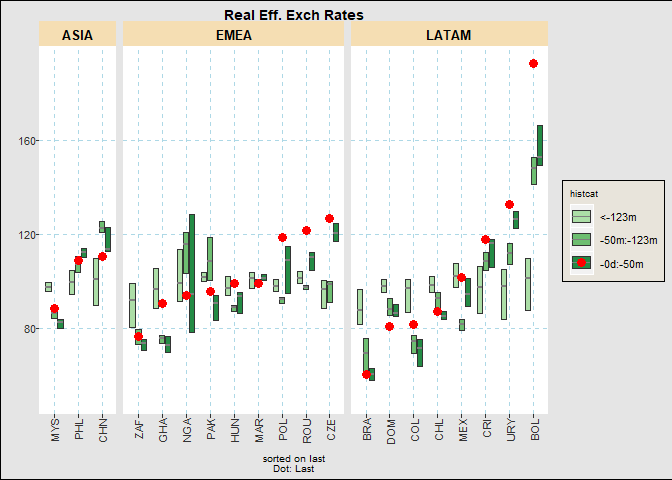

## Event Studies

Trying to understand how events or environments may impact prices can be
summarized well by plotting their movements relative to a date against
time relative to the event. The function `fg_eventStudy()` integrates a
set of dates with a set of time series to plot their relative behavior
over the business days before and after each event. It is designed to
show reasonably large sets of assets or event dates by switching
discrete color scales to gradient scales after a user specified number.

There are several ways to show the data, including path-by-path,
statistics by event (i.e. across assets) or by asset (across events),
boxplots, or scatter plots of moves at the edge of the intervals.

For example, to see the behavior of various parts of the US yield curve
around FOMC cuts, just use the following

``` r
dtset <- fg_get_dates_of_interest("fedmoves")[grepl("F:-",eventid),.(DT_ENTRY,text=eventid2)]
fg_eventStudy(yc_CMSUST,dtset,output="pathbyvar",
              title="Constant Maturity UST tenors around Fed Cuts")
```

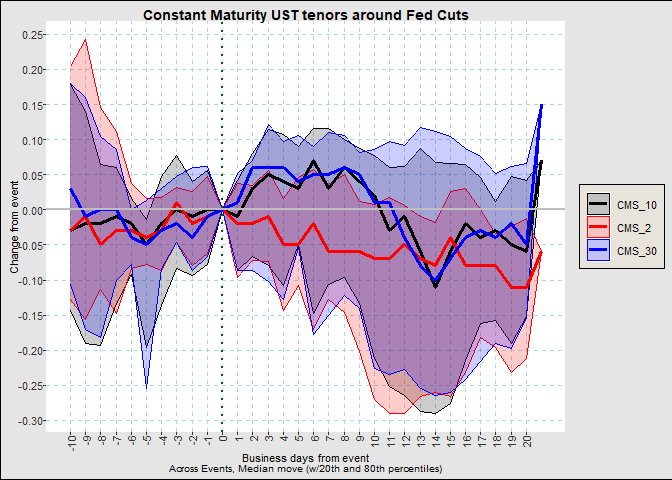

We can see that curves reach their peak steepening around a week after
the event. To see this a little more succinctly, we can use

``` r
fg_eventStudy(yc_CMSUST,dtset,output="scatter",nbd_back=5,nbd_fwd=6,
                title="Constant Maturity UST tenors around Fed Cuts at 5 days")
```

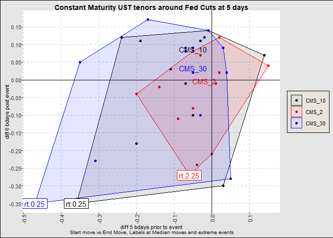
