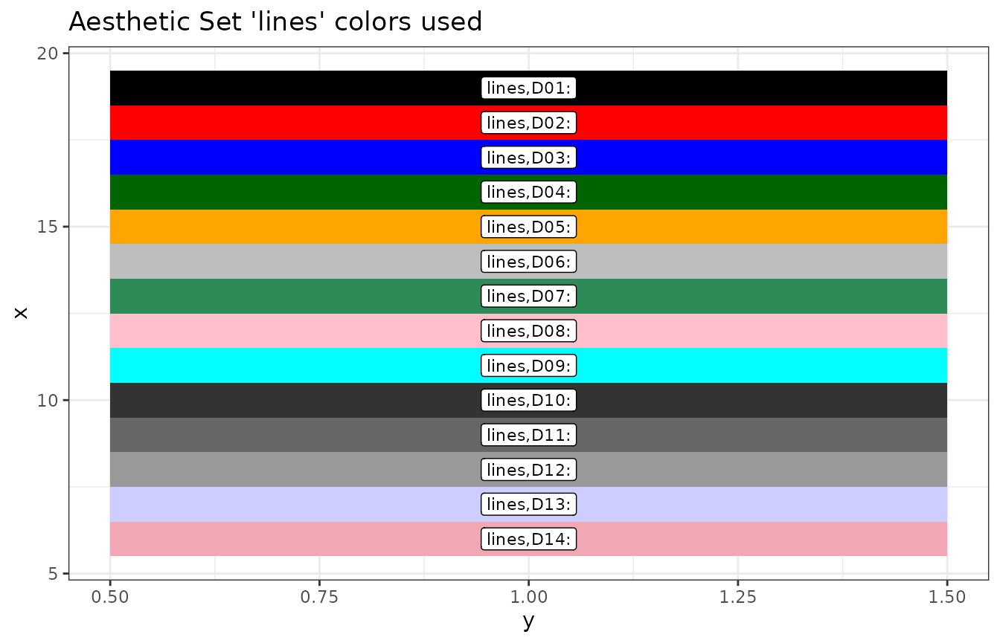
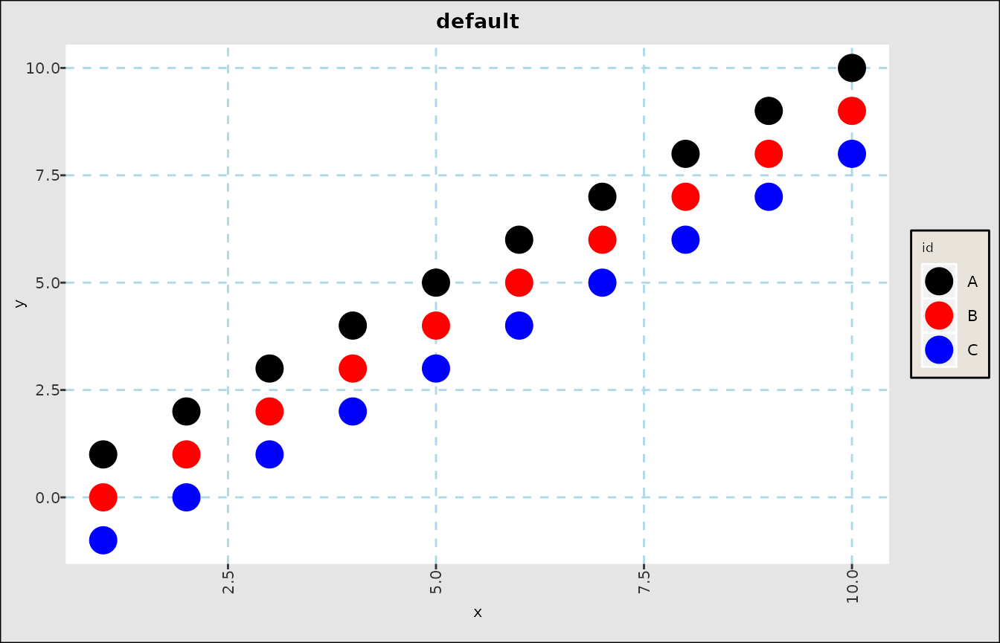
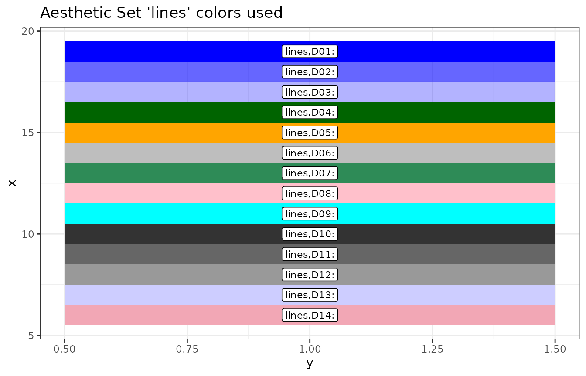
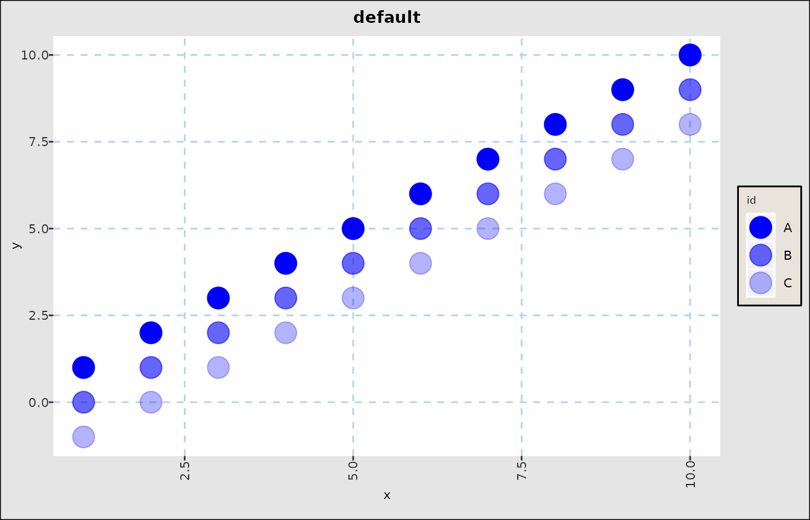
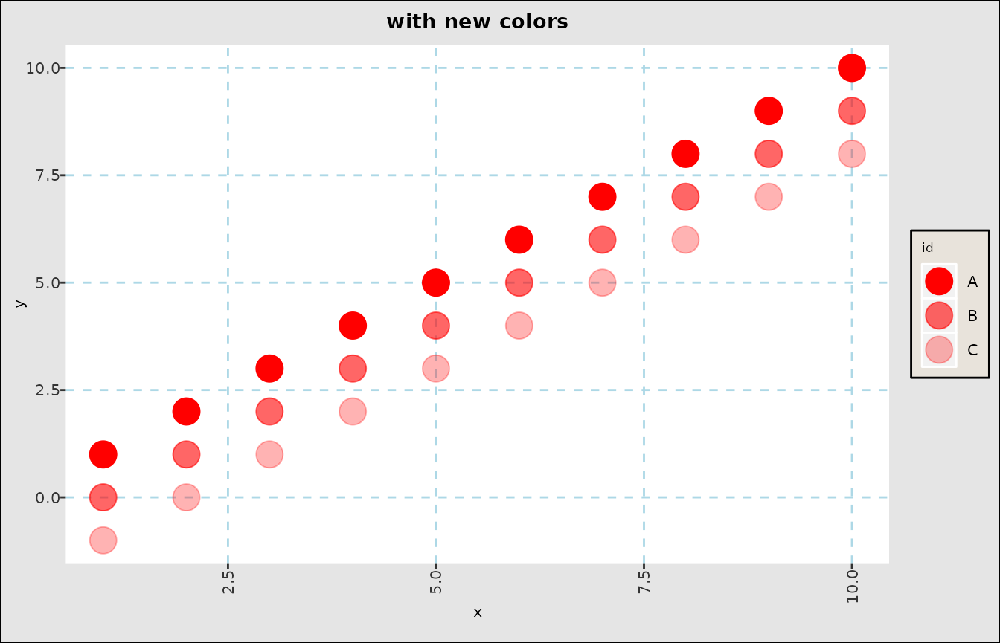
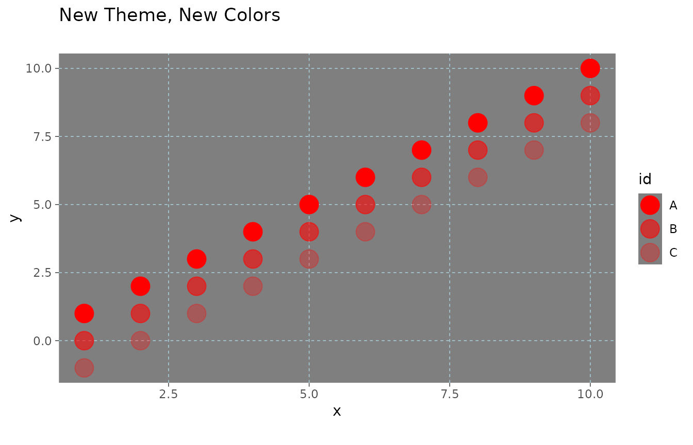
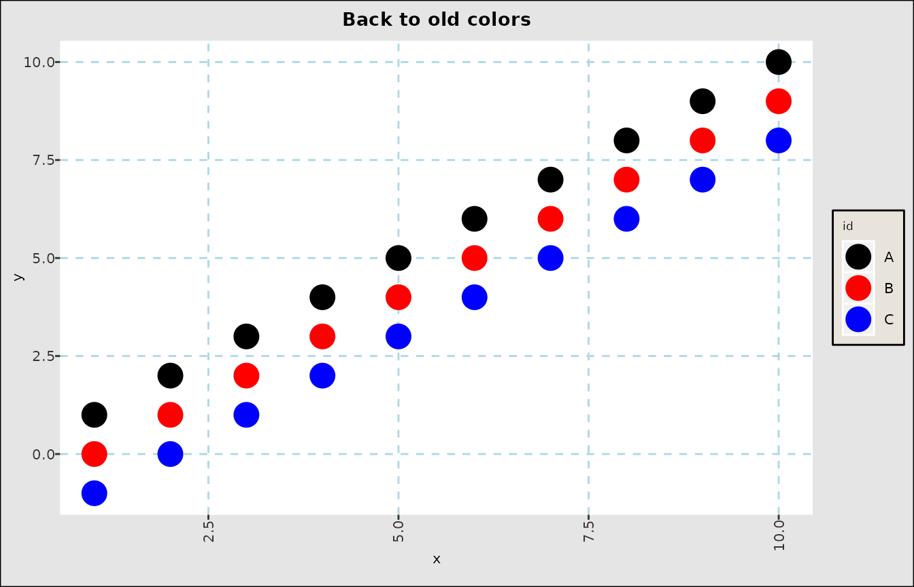

# FinanceGraphs-Customization

``` r

suppressPackageStartupMessages(require(dplyr))
suppressPackageStartupMessages(require(data.table))
suppressPackageStartupMessages(require(ggplot2))
suppressPackageStartupMessages(require(FinanceGraphs))
```

## Overview of Aesthetics Organization

Managing a consistent look across graphs is not easy, as there are so
many parameters that are possible to change.
[ggplot2](https://ggplot2.tidyverse.org/) does a great job allowing
every detail to be customized, especially with the use of themes.
However, adding all those customizations are burdensome, and ad-hoc
changes to them can involve a great deal of programming. Ideally, we
would like to keep our favorite looks in one place with an easy ability
to change just a few pieces in an ad-hoc manner.

The functions in the package attempt to ease that burden with a *middle
layer* of named aesthetic groups. Aesthetics can be managed just like
any other data, so internal to the package is a `data.table` with the
following character columns, plus a few others:

| Column | Description |
|:---|:---|
| Category | An “aesthetic set” key grouping together various subparts of a graph. |
| (Ordering) Variable | Any string that can sorted to keep the aesthetics in a desired order |
| Type | The type of aesthetic (e.g. color, size, symbol, etc) |
| Value | The actual aesthetic to be used. If a number, then each function casts appropriately |
| used | Where the function is used |

Each FinanceGraphs function has internal aesthetic names (and defaults)
that a user can modify, either persistently or temporarily. For example,
the basic set of colors for categories is `"lines"`, which are the line
colors for
[`fgts_dygraph()`](https://derekholmes0.github.io/FinanceGraphs/reference/fgts_dygraph.md)
or the category colors for `fg_scatplot`.

``` r

fg_get_aes("lines", n_max=6)
#>    category variable  type     value const used                     helpstr
#> 1:    lines      D01 color     black        all Low cardinality line colors
#> 2:    lines      D02 color       red        all Low cardinality line colors
#> 3:    lines      D03 color      blue        all Low cardinality line colors
#> 4:    lines      D04 color darkgreen        all Low cardinality line colors
#> 5:    lines      D05 color    orange        all Low cardinality line colors
#> 6:    lines      D06 color      gray        all Low cardinality line colors
```

Changing the look of graphs is as easy as changing the values in that
internal dataset. In some cases (e.g. in
[`fg_scatplot()`](https://derekholmes0.github.io/FinanceGraphs/reference/fg_scatplot.md))
a user can make an entire new aesthetic set with a new (unique) name and
directly specify it in the function call. The package keeps those
changes persistently (by default), so each users’ preferences should
only need to be specified once.

## Getting current aesthetics

There are two ways to get the aesthetic sets for every graph in the
package:

- Call the function
  [`fg_print_aes_list()`](https://derekholmes0.github.io/FinanceGraphs/reference/get_constants.md)
  with the name of a function as an argument
- Call the function
  [`fg_verbose()`](https://derekholmes0.github.io/FinanceGraphs/reference/set_constants.md)
  to turn on logging of what aesthetic sets are called for any given
  graph generated.

For example, here are the a few aesthetic sets for
[`fg_eventStudy()`](https://derekholmes0.github.io/FinanceGraphs/reference/fg_eventStudy.md).
This function just produces a summary, so for example there are actually
14 different line colors in `"lines"`.

``` r

print(fg_print_aes_list("fg_eventStudy"))
#> 
#> 
#> |category    |helpstr                     |default   |  N|
#> |:-----------|:---------------------------|:---------|--:|
#> |lines       |Low cardinality line colors |black     | 14|
#> |espath_fill |Fitline fill color          |#C2DF23FF |  1|
#> |espath_gp   |Brewer colors if used       |seq,BuGn  |  1|
#> |espath_line |fitline color               |#433E85FF |  1|
#> |espath_lm   |Fit line color              |black     |  1|
#> |espath_ls   |Line styles per event       |84        |  9|
#> |espath_x    |Scatterplot x color         |gray      |  1|
#> |espath_y    |Scatterplot y color         |darkgreen |  1|
```

Each set can have multiple rows, as in

``` r

fg_get_aes("espath_ls", n_max=6)
#>     category variable      type value const          used               helpstr
#> 1: espath_ls      L01 linestyle    84       fg_eventStudy Line styles per event
#> 2: espath_ls      L02 linestyle  8282       fg_eventStudy Line styles per event
#> 3: espath_ls      L03 linestyle  8484       fg_eventStudy Line styles per event
#> 4: espath_ls      L04 linestyle    22       fg_eventStudy Line styles per event
#> 5: espath_ls      L05 linestyle    24       fg_eventStudy Line styles per event
#> 6: espath_ls      L06 linestyle  4242       fg_eventStudy Line styles per event
```

These correspond directly to [ggplot2](https://ggplot2.tidyverse.org)
aesthetics, such as the linetypes in
[linetypes](https://ggplot2.tidyverse.org/reference/aes_linetype_size_shape.html#linetype).
Some other notes:

- Each value is a character column, but is coerced as necessary in each
  function.  
- In the cases of sizes, the values are multiples of the function
  parameters `psize` and `tsize`. So, a text size value of `"6"` gets
  converted to `tsize * 6` in each function.
- The `"variable"` column tells the functions to use `"L01"` first,
  `"L02"` second, etc. As long as the key is sortable, consistent and
  correct values should be used.
- In the case of category overload, most functions have “color switch”
  parameters beyond which colors are “brewed” scales which are
  infinitely (but not wisely) expandable. In this case, the value is
  `"seq,<colorset>"` which generates colors from a
  [Colorbrewer](https://colorbrewer2.org/#type=sequential&scheme=BuGn&n=3)
  color set.
- Colors can be color names or Hex color codes.

Colors in particular may be examined using the
[`fg_display_colors()`](https://derekholmes0.github.io/FinanceGraphs/reference/get_constants.md)
function as in

``` r

fg_display_colors("lines")
```



## Adding or customizing aesthetics

Any of the default aethetic sets can be customized across calls to the
functions and invocations of the package using
[`fg_update_aes()`](https://derekholmes0.github.io/FinanceGraphs/reference/set_constants.md)
New aesthetics sets can also be added for those functions
(e.g. [`fg_scatplot()`](https://derekholmes0.github.io/FinanceGraphs/reference/fg_scatplot.md))
where different aesthetic sets can be specified at runtime.

Modifying or adding aesthetics sets is done by creating (or copying and
editing) a `data.frame` obtained from
[`fg_get_aes()`](https://derekholmes0.github.io/FinanceGraphs/reference/get_constants.md)
As a simple example, suppose we have three related classes of assets,
one of which we wish to highlight and the others are related, but less
important. Here is how the default colors would look:

``` r

onedt <- function(offset,category) { data.table(x=seq(1,10),y=seq(1,10)-offset,id=rep(category,10))}
exampledta <- rbind(onedt(0,"A"),onedt(1,"B"),onedt(2,"C"))
fg_scatplot(exampledta,"y ~ x + color:id",title="default",psize=6)
```



### Customizing default aesthetics

The procedure for changing those colors is as follows:

1.  Get an example `data.frame` using
    [`fg_get_aes()`](https://derekholmes0.github.io/FinanceGraphs/reference/get_constants.md)
2.  Modify the values you want to change in the `value` column
3.  Update the persistent package data using
    [`fg_update_aes()`](https://derekholmes0.github.io/FinanceGraphs/reference/set_constants.md)

``` r

head(oldcolors <- fg_get_aes("lines"),3)
#>    category variable  type value const used                     helpstr
#> 1:    lines      D01 color black        all Low cardinality line colors
#> 2:    lines      D02 color   red        all Low cardinality line colors
#> 3:    lines      D03 color  blue        all Low cardinality line colors
oldcolors[c(1,2,3),"value"] <- alpha("blue", c(1,0.6,0.3))
# Note that we still keep "category" as "lines".  To add a new set, use a different name.
fg_update_aes( oldcolors )
#> Saved aesthetic updates to /home/runner/.cache/R/FinanceGraphs/fg_aes.RD
fg_display_colors("lines")
```



``` r

fg_scatplot(exampledta,"y ~ x + color:id",title="default",psize=6)
```



### Adding new aesthetics

To create our own aesthetics, we use the same procedure, but adding our
own `"category"`:

``` r

oldcolors[c(1,2,3),"value"] <- alpha("red", c(1,0.6,0.3))
oldcolors[c(1,2,3),"category"] <- rep("MyNewColors",3)
fg_update_aes( oldcolors )
#> Saved aesthetic updates to /home/runner/.cache/R/FinanceGraphs/fg_aes.RD
fg_scatplot(exampledta,"y ~ x + color:id,MyNewColors",title="with new colors",psize=6)
```



## Themes

Themes are the [ggplot2](https://ggplot2.tidyverse.org) way of
proscribing every single aesthetic detail in a graph. This package uses
a default theme derived from
[`theme_bw()`](https://ggplot2.tidyverse.org/reference/ggtheme.html),
but it is quite easy to create or modify, and more importantly **save**,
a custom theme for future use.

To do so, just call
[`fg_replace_theme()`](https://derekholmes0.github.io/FinanceGraphs/reference/set_constants.md)
as in the following example:

``` r

fg_replace_theme(theme_dark())
#> Saved Default Theme to /home/runner/.cache/R/FinanceGraphs/fg_theme.RD
fg_scatplot(exampledta,"y ~ x + color:id,MyNewColors",title="New Theme, New Colors",psize=6)
```



## Persistence

### Saved Aesthetics, themes and dates of interest persist

This package manages aesthetic changes for you by caching the current
aesthetic sets, themes, and dates of interest in local files, which are
then loaded on package invocation. If you **don’t** want save changes,
then call
[`fg_update_aes()`](https://derekholmes0.github.io/FinanceGraphs/reference/set_constants.md)
and
[`fg_replace_theme()`](https://derekholmes0.github.io/FinanceGraphs/reference/set_constants.md)
with `persist=FALSE` parameters.

To reset all parameters back to the package defaults, run
[`fg_reset_to_default_state()`](https://derekholmes0.github.io/FinanceGraphs/reference/set_constants.md)

``` r

fg_reset_to_default_state("all")
#> Removing dates file and reverting to defaults of package
#> Removing Aesthetics file and reverting to defaults of package
#> Removing User-made Themes and reverting to defaults of package
#> Removing cache Directory
#> fg_reset_to_default_state(all) completed
fg_scatplot(exampledta,"y ~ x + color:id",title="Back to old colors",psize=6)
```


